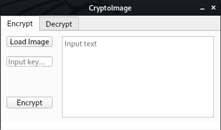

<h1 align="center">ImageCrypt</h1>

<p align="center">
  <a href="https://github.com/TheK4n">
    
  </a>
  <a href="https://github.com/TheK4n/image-crypt">
    
  </a>
</p>

* [Project description](#chapter-0)
* [Installation](#chapter-1)
* [Usage](#chapter-2)
* [FAQ](#chapter-3)


<a id="chapter-0"></a>
## Project description 

[Project](https://github.com/AlexGyver/crypto) [AlexGyver](https://github.com/AlexGyver) on Python by [TheK4n](https://github.com/TheK4n)
\
Steganography encryption script. It can hide text inside PNG image pixels. It uses AES or RSA enctyption methods.
\
_Design by [Пашушка](https://github.com/PAPASKAS)_


<a id="chapter-1"></a>
## Installation:

### From AUR
```bash
yay -S image-crypt
```


### Install by pacman (Recommended)

```bash
git clone https://github.com/TheK4n/image-crypt.git
cd image-crypt
makepkg -sic
```


### Install from source

```bash
git clone https://github.com/TheK4n/image-crypt.git
cd image-crypt
make install
```

<a id="chapter-2"></a>
## Usage

### GUI:
```
image-crypt-qt
```
[]()


### CLI:

```bash
image-crypt --help
```
**Result**:
```text
usage: image-crypt [-h] (-e | -d) [-o OUTPUT] images [images ...]

Stenography encryption tool

positional arguments:
  images                path to image to encrypt of decrypt

optional arguments:
  -h, --help            show this help message and exit
  -e, --encrypt         encrypts text in image
  -d, --decrypt         decrypts text from image
  -o OUTPUT, --output OUTPUT
                        name of output image
```

\
For **encryption**: 
```bash
image-crypt -e images/test.jpg
```
**Result**: saved image with default name _image_encrypted.png_


For **decryption**: 
```bash
image-crypt -d test_encrypted.png
```
**Result**: decrypted text

\
**Example:**
```bash
echo "test message" | image-crypt -e image.png -o test_image.png

image-crypt -d test_image.png > res.txt
```

<br>

### Docker:

**Example:**
```bash
docker run --rm -it -v $(pwd):/image-crypt -w /image-crypt thek4n/image-crypt image-crypt -e image.png
```
> `/image-crypt` - Container\`s directory\
> `thek4n/image-crypt` - Image on DockerHub\
> `image-crypt` - Program name\
> `image.png` - Your image in <ins>your work directory</ins>

Enter the text, press <kbd>Ctrl</kbd> + <kbd>d</kbd> and enter the passphrase

**Result**: Encrypted image in work directory


<a id="chapter-3"></a>
# FAQ

> *Q*: What is the level of cryptographic strength?

> *A*: It uses symmetric and asymmetric encryption methods such as AES and RSA.

<br>

> *Q*: Does it pack the image data into text?

> *A*: No, it's packing text into image pixels.


<h1 align="center"><a href="#top">▲</a></h1>
